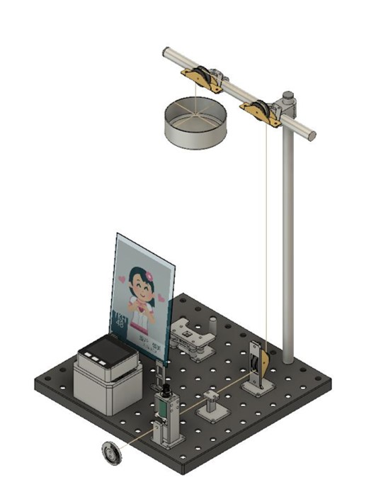
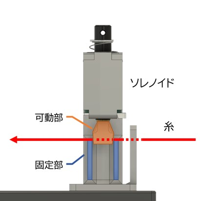
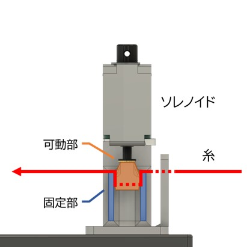
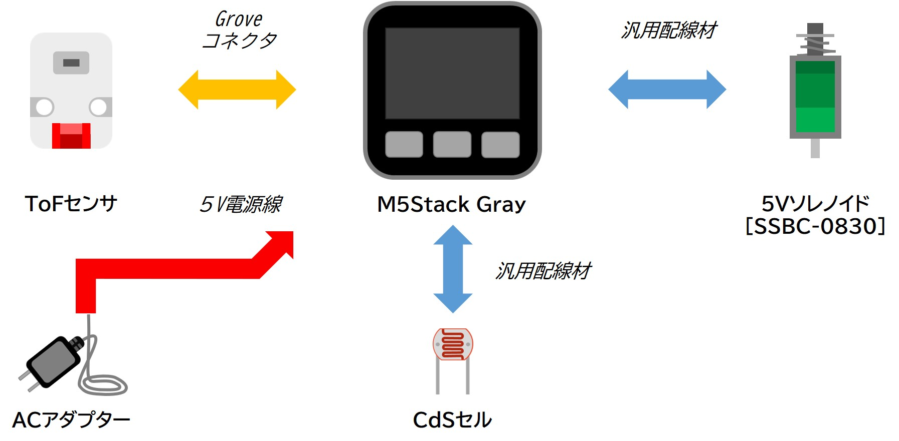
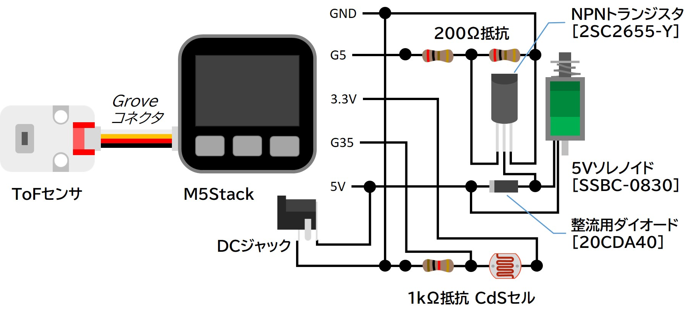

# TunaCanCan

本リポジトリは[第9回タカハソレノイドコンテスト(ソレコン)](https://www.takaha.co.jp/co/solcon/)の開発リポジトリです．  
誰もがテレビで見たことのあるタライ落としをツナ缶で再現してみました．本作品はソレノイドによるツナ缶ブレーキ機構とToFセンサによる自動高さ計測機能を搭載しており，タライ落としと比較して利便性・安全性に優れたものとなっています．

# DEMO
紹介動画は下記サムネイルをクリック！  

# Features
ツナ缶ブレーキ機構の基本原理はうなぎの掴み方を参考にしています．３本の指で挟むことで滑りやすいうなぎを持つことができますが，本作品でも下図に示す機構により細く滑りやすい糸の把持を実現しています．  

# S/W
## Requirement
* [M5Stack Library](https://github.com/m5stack/M5Stack)
* [M5Stack SimpleBeep library](https://github.com/haratta27/M5Stack_SimpleBeep)
* [VL53L0X library for Arduino](https://github.com/pololu/vl53l0x-arduino)

# H/W
## Configuration and Wiring
* システム構成図  

* 配線図  

## Parts List
* 電装部品
    * [M5Stack Gray](https://www.switch-science.com/catalog/3648/) 1個
    * [M5Stack用BUSモジュール](https://www.switch-science.com/catalog/6062/) 1個
    * [5Vソレノイド[SSBC-0830]](https://www.takaha.co.jp/SHOP/ssbc-0830.html) 1個
    * [ToFセンサ](https://www.switch-science.com/catalog/5219/) 1個
    * CdSセル 1個
    * [NPNトランジスタ[2SC2655-Y]](https://eleshop.jp/shop/g/gSC265Y/) 1個
    * [整流用ダイオード[20CDA40]](https://www.sengoku.co.jp/mod/sgk_cart/detail.php?code=EEHD-583Z) 1本
    * 1/4W 200Ωカーボン抵抗 2本
    * 1/4W 1kΩカーボン抵抗 1本
    * [DCジャック](https://www.sengoku.co.jp/mod/sgk_cart/detail.php?code=EEHD-4KCY) 1個
    * ACアダプタ(5V2A, センタープラス, PL03B) 1個
    * [ユニバーサル基板(40mm✕60mm)](www.amazon.co.jp/dp/B07TTMGK9K) 1枚
    * その他配線材料
* 筐体部品等
    * ツナ缶 1個
    * [ポール（中）３９ｃｍクロームメッキ](https://jp.daisonet.com/products/4549131189872) 1本
    * [ポール（短）２５ｃｍクロームメッキ](https://jp.daisonet.com/products/4549131189889) 1本
    * [パンチングボード（カラー、２５ｃｍｘ２５ｃｍ）](https://jp.daisonet.com/products/4549892506628) 1個
    * [フジ リムナイロン戸車[RM24]](http://www.yaboshi.co.jp/catalog_vol7_87.pdf) 3個
    * [3Dプリント部品](/stl)
    * [L判写真](/img) 1枚
    * L判用硬質ケース 1枚
    * 糸
    * ネジやナットなどの締結部品

# Note
応募受付 2022年1月7日（金）〜2月10日（木）  
結果発表 2022年2月下旬

# Author
Uma919 [Twitter](https://mobile.twitter.com/Uma_919)  
九州工業大学(Kyutech)

# License
"TunaCanCan" is under [MIT license](https://en.wikipedia.org/wiki/MIT_License).

